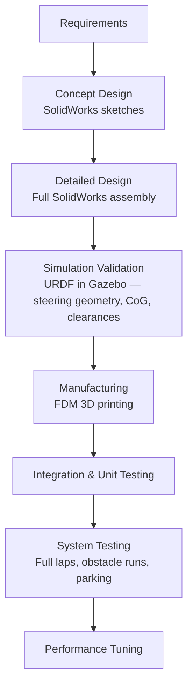
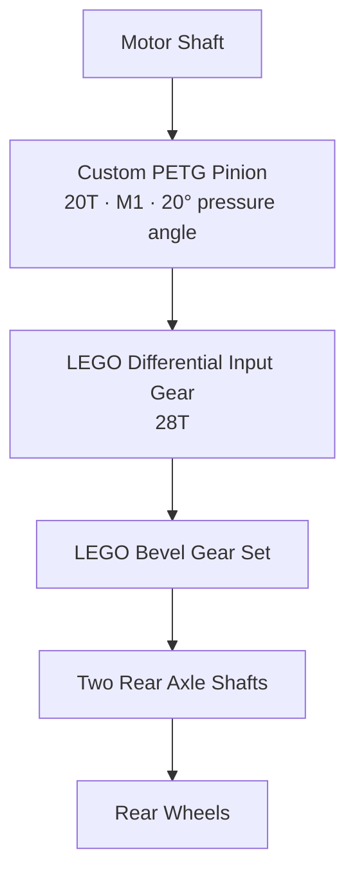

# Cyberion
Autonomous Ackermann-steering vehicle developed for the WRO Future Engineers 2026 competition. Includes mechanical design, electronics, control software, computer vision, sensor integration, and engineering documentation.
We are a team of three students who share more than just a passion for robotics — we share three years of friendship, late nights debugging code, and the relentless drive to build something extraordinary. What started as a shared curiosity for technology has evolved into a serious engineering partnership, where each of us brings a unique and irreplaceable skill set to the table.


<p align="center">

Ali Essa serves as our software architect and programming lead. He is responsible for the full software stack of our self-driving vehicle — from low-level motor control to high-level computer vision algorithms. His ability to translate complex engineering problems into elegant, efficient code is the brain behind our robot's autonomous decision-making.

Ibrahim Jneed & Lujain Alahmad form our hardware and electrical engineering duo. Ibrahim and Lujain are responsible for the complete 3D mechanical design, chassis engineering, and all electrical wiring and circuit architecture. Their precision in design and deep understanding of electromechanical systems ensure that every component fits, functions, and performs under competition conditions.

Together, we do not just build robots — we engineer solutions. Every decision we make is driven by data, testing, and a shared obsession with pushing our vehicle's performance to its absolute limit.

## Executive Summary

Cyberion is an autonomous vehicle built for the WRO Future Engineers 2026 competition. The vehicle features a rear-wheel-drive drivetrain powered by a JSUMO Titan 12V DC motor and an Ackermann steering mechanism actuated by an MG996R servo. The complete mechanical system was designed in SolidWorks and validated in Gazebo before any part was manufactured. Custom structural components are FDM-printed PETG, and the full software stack runs on a Raspberry Pi 5 communicating with an ESP32 for real-time motor and sensor control.

## Design Methodology



A redesign iteration in SolidWorks takes ~20 minutes. The equivalent physical rework takes 4–8 hours. This workflow resulted in only one physical chassis revision after the simulation stage.

## Mobility & Mechanical Design

This folder contains all mechanical design assets for the Cyberion autonomous vehicle, built for the World Robot Olympiad (WRO) Future Engineers 2026 competition.

### Overview

The mechanical system was designed entirely in SolidWorks before any physical part was manufactured. The complete CAD assembly was exported as a URDF and validated in Gazebo Harmonic 8.11.0 on the official WRO 2026 competition map — confirming steering geometry, sensor field-of-view, centre-of-gravity height, and clearances — before a single part was printed.

All custom structural components are FDM-printed PETG. PETG was chosen over PLA for its higher impact resistance (notched Izod ≈ 6 kJ/m² vs. 3.5 kJ/m²) and lower moisture sensitivity.

### Chassis Architecture — Two-Level Layout

The chassis is split into two functional levels:

| Level |                                                                      Contents                                                                      |
|:-----:|:--------------------------------------------------------------------------------------------------------------------------------------------------:|
| Lower | Ackermann steering linkage, JSUMO Titan drive motor, BTS7960 motor driver, LEGO differential, custom pinion, rear axle shafts, MG996R servo, esp32 |
| Upper |                                                    Raspberry Pi 5, battery holders, IMU (BNO086)                                                   |


### Vehicle specifications:

|            Parameter            |     Value     |
|:-------------------------------:|:-------------:|
| Footprint                       | 300 × 200 mm  |
| Body width                      | 185 mm        |
| Wheelbase                       | 170 mm        |
| Front / rear track width        | 140 mm        |
| Total mass (calculated)         | ~894 g        |
| Front / rear weight split       | 37.2% / 62.8% |
| Max CoG height (rollover limit) | 136.25 mm     |

### 3D Printed Parts

All parts are printed in PETG at 100% infill for structural components.

|        Part Name        |     File in Repository     |                                              Location on Robot                                              |
|:-----------------------:|:--------------------------:|:-----------------------------------------------------------------------------------------------------------:|
| Lower Chassis (Level 1) | base1.STL                  | Main structural base — houses drivetrain, steering, and servo                                               |
| Upper Chassis (Level 2) | base2.STL                  | Top platform — holds Raspberry Pi 5 and battery                                                             |
| Flange Bearing Housing  | Flange Bearing Housing.STL | Rear axle — holds 626RS bearings that support the rear axle shafts                                          |
| Motor Holder            | Motor Holder .STL          | Lower chassis — mounts the JSUMO Titan DC motor in place                                                    |
| LEGO Wheel Adapter      | LEGOWHEEL.STL              | Rear axle — adapts LEGO axle shaft to the wheel hub                                                         |
| Camera Housing          | camera housing.STL         | Front upper section — holds the Raspberry Pi Camera Module V2                                               |
| Steering Knuckle        | fix part for wheel.STL     | Front axle — rotates around the kingpin axis to steer each front wheel                                      |
| Steering Arm            | new steering arm.STL       | Front axle — connects tie rod to the steering knuckle to form the Ackermann linkage                         |
| Custom Pinion Gear      | pinion.STL                 | Lower chassis — transfers torque from the motor shaft to the LEGO differential (20T, M1, 20°)               |
| Servo Horn              | servo horn.STL             | Steering servo output shaft — links servo to the tie rod with a 20 mm effective arm length                  |
| Tie Rod                 | tie rod.STL                | Between servo horn and steering knuckles — transmits servo displacement to both front wheels simultaneously |

### Steering System — Ackermann Geometry

Ackermann geometry was selected because it enforces the rolling constraint across the full steering range: both front wheels trace concentric arcs around a common instantaneous centre, eliminating lateral tyre scrub and producing a consistent, predictable cornering radius.

The steering arm angle was iterated in SolidWorks from an initial parallel (non-compliant) configuration until simulation confirmed the inner wheel consistently steers to a larger angle than the outer wheel across the full servo travel.


#### Linkage parameters:

|                Parameter                |  Value  |
|:---------------------------------------:|:-------:|
| Kingpin axis separation (T)             | 100 mm  |
| Wheelbase (L)                           | 170 mm  |
| T/L ratio (Ackermann condition)         | 0.588   |
| Steering arm length                     | 40 mm   |
| Steering arm angle from transverse axis | 23.5°   |
| Tie rod length                          | 70 mm   |
| Custom servo horn effective length      | 20 mm   |
| Inner wheel max angle                   | 30.22°  |
| Outer wheel max angle                   | 22.24°  |
| Measured minimum turning radius         | ~346 mm |

Kingpin axes each use a 626RS deep-groove ball bearing (6 mm ID, 19 mm OD) to minimise friction and ensure full servo torque reaches the wheels.

Actuator: MG996R servo (all-metal gear train). Required steering torque: 0.028 N·m. Available torque at 4.8 V: 0.922 N·m → safety margin of 32.8×.

The servo is mounted directly through a rectangular aperture in the lower chassis plate — no bracket — to eliminate any compliance joint that could add backlash under repeated steering reversals.

### Drivetrain — Rear-Wheel Drive with Mechanical Differential

Drive motor: JSUMO Titan DC, 12 V nominal, 1000 RPM no-load, 7.5 kg·cm stall torque.

#### Power transmission chain:




|           Parameter          |   Value  |
|:----------------------------:|:--------:|
| Overall gear ratio           | 1.4 : 1  |
| Wheel speed                  | 714 RPM  |
| Rear wheel diameter          | 43.2 mm  |
| Theoretical top speed        | 1.61 m/s |
| Measured top speed (75% PWM) | 1.21 m/s |

PWM is capped at 75% in software so the effective motor voltage stays at ≈ 12.6 V from the 16.8 V fully-charged 4S battery.

The LEGO differential was chosen over a fully printed differential because FDM bevel gears showed visible mesh interference and high drag torque from layer-line surface roughness. The injection-moulded LEGO set provides a consistent, low-friction mesh.

### Design iterations:

| # |                            Problem observed                            |                              Change made                              |                            Outcome                            |
|:-:|:----------------------------------------------------------------------:|:---------------------------------------------------------------------:|:-------------------------------------------------------------:|
| 1 | Fully printed differential: bevel mesh interference, high drag torque  | Replaced with LEGO differential + custom mounting interface           | Internal drag reduced; mesh quality repeatable between builds |
| 2 | Off-the-shelf pinion: poor fit on D-shaft, poor mesh with differential | Custom SolidWorks pinion matched to both interfaces                   | Backlash and tooth-tip loading reduced                        |
| 3 | Printed axle shafts: lower torsional strength, complex assembly        | Standard LEGO axles retained by custom PETG bushings in bearing bores | Torsional failure risk eliminated; assembly simplified        |

### URDF Export

The SolidWorks assembly was exported to URDF using the sw_urdf_exporter plugin (v1.6.0). The export produced the full link hierarchy, mass and inertia tensors computed directly from the CAD material assignment, and one STL mesh per link.

The URDF file serves as the formal handoff between the mechanical and software teams — the mechanical team is responsible for geometric and inertial accuracy, and the software team uses it as the definitive robot model for all simulation and motion planning work.

Electronic component masses not modelled in SolidWorks were added manually as point masses at their defined mounting locations directly inside the URDF file.

The file is located at models/urdf2/urdf/urdf2.urdf and contains:

Link hierarchy with mass and inertia tensors
One STL mesh per link, referenced from models/urdf2/meshes/
Sensor frame placements for the four ToF sensors, the IMU, and the camera
Gazebo Ackermann steering system plugin


### Simulation — Gazebo Harmonic 8.11.0

The URDF model was imported into Gazebo and a simulation environment replicating the official WRO Future Engineers 2026 competition map was constructed. The robot was driven autonomously through the complete challenge sequence in simulation before any physical part was printed.

This step validated both the software algorithms and the mechanical configuration — confirming that:

The Ackermann steering geometry produces the correct turn radii at maximum servo deflection
Sensor mounting positions achieve the required field-of-view coverage over the actual field geometry
The centre-of-gravity height stays within the rollover stability limit at maximum operating speed
No part of the chassis contacts the track boundary walls during any manoeuvre


A redesign iteration in SolidWorks takes ~20 minutes. The equivalent physical rework — reprint, reassemble, recalibrate — takes 4–8 hours. This workflow resulted in only one physical chassis revision after the simulation stage.


## ⚡️ Electronic Systems

Our robot's electronic architecture is built around a clear separation of responsibilities: a Raspberry Pi 5 handles all vision processing and high-level navigation, while an ESP32 microcontroller manages every time-critical control task — motor drive, steering, and sensor reading — in real time. These two processors communicate over a dedicated UART serial link, keeping vision latency completely isolated from motion control.

Power is distributed across three independent paths: the drive motor is fed directly from the 4S Li-ion battery through a BTS7960 H-bridge driver, the steering servo runs from a dedicated regulated Rail A, and all computing and sensing electronics share a separate regulated Rail B. This three-way separation ensures that motor switching transients and servo current spikes never reach the Raspberry Pi 5, ESP32, or sensors. A full Fritzing wiring diagram documenting every power and signal connection is included in the repository.

### Components

The diagram below shows the full wiring architecture — power distribution paths, signal connections, and communication links between all major components. A complete Fritzing source file is included in the /fritzing directory.


#### Battery — Li-ion 18650 (×4, 4S Pack)

The robot is powered by a 4S Li-ion battery pack consisting of four 3.7 V, 2200 mAh 18650 cells connected in series. The pack provides 14.8 V nominal voltage and reaches 16.3 V when fully charged. It stores 32.56 Wh, with approximately 22.79 Wh usable at 70% DoD. The measured runtime under full competition load is 95 minutes. The cells are rated for 2.2 A continuous discharge (1C) and 4.4 A burst discharge (2C), with a system low-voltage cut-off at 12.0 V.

#### Power Regulation — LM2596 Buck Converters

Two LM2596 HW-411 buck converters regulate the battery voltage to 5 V. Rail A is dedicated to the MG996R steering servo, providing isolation from servo current spikes, with a measured efficiency of 84.5%. Rail B supplies the Raspberry Pi 5, ESP32, and all sensors, with a measured efficiency of 83.1%. Both rails operate from the 16.3 V maximum battery voltage and provide a regulated 5.00 V output.


#### Raspberry Pi 5 (8GB)

The Raspberry Pi 5 is the main computing unit and runs the Python/OpenCV vision and navigation pipeline on its quad-core ARM Cortex-A76 processor. It connects to the camera through CSI-2 and communicates with the ESP32 through UART. Its typical and peak current consumption is approximately 0.80 A and 1.80 A, respectively, and it is powered from Rail B.


#### Raspberry Pi Camera Module 2

The Raspberry Pi Camera Module 2, based on the Sony IMX219 8 MP sensor, is connected to the Pi 5 through a CSI-2 ribbon cable. It captures colour images for real-time HSV-based obstacle classification. During validation, the system achieved 95% detection accuracy (19/20 correct detections) under approximately 500 lux fluorescent lighting.


#### ESP32-WROOM-32

The ESP32-WROOM-32 DevKit v1 handles all real-time control tasks, including motor PWM, steering control, and continuous I²C sensor polling. Its dual-core 240 MHz processor keeps motion control independent of the Raspberry Pi's Linux scheduling. The ESP32 operates at a sensor polling rate of 100 Hz, with typical and peak current consumption of approximately 0.080 A and 0.250 A, respectively.


#### JSumo Titan DC Motor — 12 V / 1000 RPM

The JSumo Titan DC motor is powered directly from the battery through the BTS7960 driver. At a 72% PWM duty cycle, the effective motor voltage is approximately 11.20 V. During testing, the robot achieved a measured field speed of 1.5 m/s, with a typical motor load current of approximately 1.20 A and a measured stopping distance of 0.56 m.


#### BTS7960B Motor Driver

The BTS7960B is a high-current MOSFET H-bridge used to control the drive motor in both directions through PWM. It is rated up to 43 A absolute maximum and accepts the ESP32's 3.3 V logic signals directly. The driver is connected directly to the battery and operates over the 12.0–16.8 V supply range.


#### TowerPro MG996R Servo

The MG996R provides steering control and is powered separately from Rail A to isolate its current spikes from the logic electronics. It uses a 50 Hz PWM control signal, with a typical current of approximately 0.35 A and a measured stall current of 2.50 A. Its rated stall torque is approximately 9.4 kgf·cm at 4.8 V.


#### BNO086 IMU

The BNO086 IMU is mounted near the geometric centre of the robot and provides heading and angular-rate information through the I²C bus. After zero-rate bias calibration to 0.018°/s, controlled 90° turns showed a validated heading error of 1.8°, while the total drift during a full competition run was approximately 3.2°. The IMU is powered from the ESP32's 3.3 V supply.


#### VL53L0X ToF Sensors (×4)

Four VL53L0X time-of-flight sensors provide distance measurements in the front, rear, left, and right directions. They share a single I²C bus, with individual XSHUT control used during startup to assign unique addresses from 0x30 to 0x33. The four sensors consume approximately 64 mA combined, and the measured distance error remains within ±12 mm across the specified operating range. They are powered from Rail B.

### Power Consumption Summary
|        Component       |      Voltage      | Typical Current | Peak Current |   Power Rail   |
|:----------------------:|:-----------------:|:---------------:|:------------:|:--------------:|
| Raspberry Pi 5 (8GB)   | 5 V               | 0.80 A          | 1.80 A       | Rail B         |
| RPi Camera Module 2    | 3.3 V (via Pi 5)  | 0.13 A          | 0.25 A       | via Pi 5       |
| ESP32-WROOM-32         | 5 V → 3.3 V       | 0.080 A         | 0.250 A      | Rail B         |
| BNO086 IMU             | 3.3 V (via ESP32) | 10.7 mA         | 16 mA        | via ESP32      |
| VL53L0X ToF ×4         | 5 V → 2.8 V       | 64 mA total     | 40 mA each   | Rail B         |
| TowerPro MG996R Servo  | 5 V               | 0.35 A          | 2.50 A       | Rail A         |
| JSumo Titan DC Motor   | 12 V (PWM)        | 1.20 A          | 5.00 A       | Battery direct |
| BTS7960B Motor Driver  | 12 – 16.8 V       | 1.14 mA         | —            | Battery direct |
| LM2596 Rail A          | 16.3 V → 5 V      | 0.128 A         | —            | Battery        |
| LM2596 Rail B          | 16.3 V → 5 V      | 0.400 A         | —            | Battery        |
| 4S Li-ion Pack (total) | 14.8 V nominal    | 0.744 A         | —            | Source         |


### Power Budget

Every watt counts in competition. Here's exactly where the power goes — calculated from measured values, not estimates.

The brain (Rail B — Logic & Sensors)
The Pi 5 with camera draws 0.913 A, the ESP32 adds 0.083 A, and four ToF sensors contribute 0.064 A — totalling 1.060 A at 5.03 V. That's 5.332 W at the rail, which means the battery has to supply 6.441 W to cover the LM2596's 83.1% conversion loss.

The muscles (Rail A — Servo)
The steering servo runs on its own isolated rail. At 0.347 A × 5.02 V = 1.742 W out, the battery delivers 2.061 W through the LM2596 at 84.5% efficiency — completely isolated from everything else.

The drive (Motor — Direct)
The motor bypasses regulation entirely, fed straight from the pack at 72% PWM. Effective voltage: 11.20 V, current: 0.300 A — 3.36 W of mechanical output, drawing 0.216 A directly from the battery.

Total Battery Load
|           Path           | Battery Current | Battery Power |
|:------------------------:|:---------------:|:-------------:|
| Rail B — Logic & Sensors | 0.400 A         | 6.441 W       |
| Rail A — Servo           | 0.128 A         | 2.061 W       |
| Motor — Direct           | 0.216 A         | 3.370 W       |
| Total                    | 0.744 A         | 11.872 W      |

Runtime — the bottom line

With 22.79 Wh of usable energy and an average draw of 12.45 W, the math gives 110 minutes. Real-world testing came in at 95 minutes  — a healthy margin that accounts for acceleration peaks and steering transients the steady-state model doesn't capture.
Calculated: 22.79 ÷ 12.45 = 110 min · Measured: 95 min 
We run two identical 4S packs in rotation: one powers the robot, the other charges. A full competition run takes well under 95 minutes, so a fresh pack is always ready before the other is depleted.

### Connection & Pin Assignment
|             From            |               To              |          Signal         |
|:---------------------------:|:-----------------------------:|:-----------------------:|
| ESP32 GPIO 25               | BTS7960 RPWM                  | Motor PWM — forward     |
| ESP32 GPIO 26               | BTS7960 LPWM                  | Motor PWM — reverse     |
| ESP32 GPIO 27 + 14          | BTS7960 R_EN + L_EN           | Driver enable           |
| ESP32 GPIO 13               | MG996R signal                 | Steering PWM 50 Hz      |
| ESP32 GPIO 21 (SDA)         | BNO086 SDA + VL53L0X ×4 SDA   | Shared I²C data 400 kHz |
| ESP32 GPIO 22 (SCL)         | BNO086 SCL + VL53L0X ×4 SCL   | Shared I²C clock        |
| ESP32 GPIO 32 / 33 / 4 / 15 | VL53L0X #1–#4 XSHUT           | Address assignment      |
| ESP32 GPIO 16 (RX2)         | Pi 5 GPIO 14 (TXD)            | UART Pi → ESP32         |
| ESP32 GPIO 17 (TX2)         | Pi 5 GPIO 15 (RXD)            | UART ESP32 → Pi         |
| Rail B 5 V                  | ESP32 VIN + Pi 5 + VL53L0X ×4 | Logic & sensor supply   |
| ESP32 3V3                   | BNO086 VIN                    | IMU supply              |
| Battery +                   | BTS7960 B+                    | Motor power             |
| Common GND                  | All components                | Single-point ground     |


and the next Figure presents the complete electrical and electronic architecture of the robot, showing the power distribution paths, regulated voltage rails, communication interfaces, motor and steering control, and connections between the Raspberry Pi 5, ESP32, and all onboard sensors.


## src

### Simulation

1. Extract `wro2026_sim.zip` to any directory on your Ubuntu 24.04 system.
2. Open a terminal and navigate to the extracted folder:
```bash
   cd ~/<path-to-extracted-folder>/wro2026_sim
```
3. Set the Gazebo resource path:
```bash
   export GZ_SIM_RESOURCE_PATH=$PWD/models:$PWD/worlds
```
4. Launch the simulator:
```bash
   gz sim -r worlds/world.sdf
```
5. The simulator should now open successfully.

### Codes

#### ESP32 Motor Subscriber

A micro-ROS firmware for the ESP32 that bridges ROS 2 Jazzy with the robot's hardware. It subscribes to `/cmd_vel` and drives the BTS7960 motor driver and steering servo, while publishing sensor data from 4× VL53L0X ToF sensors and a BNO086 IMU.

##### Hardware

##### ROS 2 Topics

| Topic | Type | Direction |
|---|---|---|
| `/cmd_vel` | `geometry_msgs/Twist` | Subscribe |
| `/tof_left` | `sensor_msgs/LaserScan` | Publish |
| `/tof_front` | `sensor_msgs/LaserScan` | Publish |
| `/tof_right` | `sensor_msgs/LaserScan` | Publish |
| `/tof_back` | `sensor_msgs/LaserScan` | Publish |
| `/imu` | `sensor_msgs/Imu` | Publish |
| `/odom` | `nav_msgs/Odometry` | Publish |

##### Requirements

- Ubuntu 24.04
- VS Code + PlatformIO Extension
- ROS 2 Jazzy (for the micro-ROS agent)
- ESP32 connected via USB

##### Build & Flash Instructions

###### 1. Extract the project

```bash
unzip esp32_motor_subscriber.zip
cd esp32_motor_subscriber
```

###### 2. Open in VS Code

```bash
code .
```

> PlatformIO will automatically detect `platformio.ini` and install all required libraries including `micro_ros_platformio`, `ESP32Servo`, `VL53L0X`, and `SparkFun_BNO08x`. Wait until the installation completes.

###### 3. Connect your ESP32

Connect your ESP32 to your computer via USB, then verify the port:

```bash
ls /dev/ttyUSB* /dev/ttyACM*
```

If you get a permission error, run:

```bash
sudo usermod -aG dialout $USER
```

Then **log out and log back in**.

###### 4. Build & Upload

Click the **Upload** button (→) in the PlatformIO toolbar, or run:

```bash
pio run --target upload
```

###### 5. Monitor Serial Output

```bash
pio device monitor --baud 115200
```

##### Running with ROS 2

After flashing, start the micro-ROS agent on the Raspberry Pi to connect the ESP32 to the ROS 2 network:

```bash
ros2 run micro_ros_agent micro_ros_agent serial --dev /dev/ttyUSB0 -b 115200
```

> Replace `/dev/ttyUSB0` with your actual port from step 3.

Then verify the topics are publishing:

```bash
ros2 topic hz /imu /tof_front /tof_left /tof_right /tof_back /odom
```

#### motor_controller

ROS 2 Jazzy package that implements the robot's motion logic for the WRO 2026 Future Engineers competition. It connects to the Gazebo Harmonic simulation via `ros_gz_bridge` and runs two nodes: a classical-CV color detector and a 4-state FSM motion controller.

##### Package Structure

```
ros2_ws/src/motor_controller/
├── config/
│   ├── bridge.yaml          # ros_gz_bridge topic map
│   └── params.yaml          # all tunable parameters
├── include/motor_controller/
│   ├── kalman.hpp           # Kalman filter (roll/pitch)
│   └── pid_controller.hpp   # reusable PID class
├── launch/
│   └── bridge.launch.py     # launches bridge + both nodes
├── scripts/
│   └── motor_controller.py  # camera color detector node
├── src/
│   ├── color_motor_controller.cpp  # FSM motion controller node
│   └── kalman.cpp
├── CMakeLists.txt
└── package.xml
```

##### Nodes

###### `camera_subscriber` (`motor_controller.py`)
Subscribes to `/camera` and publishes the detected color on `/detected_color`.

| Topic | Type | Direction |
|---|---|---|
| `/camera` | `sensor_msgs/Image` | Subscribe |
| `/detected_color` | `std_msgs/String` | Publish (`RED` / `GREEN` / `MAGENTA` / `NONE`) |

###### `color_motor_controller` (`color_motor_controller.cpp`)
4-state FSM that subscribes to all sensors and publishes motion commands.

| Topic | Type | Direction |
|---|---|---|
| `/tof_front` | `sensor_msgs/LaserScan` | Subscribe |
| `/tof_back` | `sensor_msgs/LaserScan` | Subscribe |
| `/tof_left` | `sensor_msgs/LaserScan` | Subscribe |
| `/tof_right` | `sensor_msgs/LaserScan` | Subscribe |
| `/imu` | `sensor_msgs/Imu` | Subscribe |
| `/odom` | `nav_msgs/Odometry` | Subscribe |
| `/detected_color` | `std_msgs/String` | Subscribe |
| `/cmd_vel` | `geometry_msgs/Twist` | Publish |
| `/fsm_state` | `std_msgs/String` | Publish |
| `/lap_complete` | `std_msgs/Bool` | Publish |

##### Build & Run

###### Step 1 — Extract the workspace

Extract `ros2_ws.zip` to any directory you prefer:

```bash
unzip ros2_ws.zip
cd ros2_ws
```

###### Step 2 — Build the package

```bash
colcon build --packages-select motor_controller --symlink-install
source install/setup.bash
```

> Use `--symlink-install` so that changes to `params.yaml` and `motor_controller.py` take effect immediately without rebuilding.

###### Step 3 — Start Gazebo (separate terminal)

Extract `wro2026_sim.zip` to any directory you prefer, then run:

```bash
cd wro2026_sim
export GZ_SIM_RESOURCE_PATH=$PWD/models:$PWD/worlds
gz sim -r worlds/world.sdf
```

###### Step 4 — Launch the bridge and both nodes

**Open Challenge:**
```bash
source install/setup.bash
ros2 launch motor_controller bridge.launch.py challenge_mode:=open
```

**Obstacle Challenge:**
```bash
source install/setup.bash
ros2 launch motor_controller bridge.launch.py challenge_mode:=obstacle
```

##### Monitoring

```bash
# FSM state and lap counter
ros2 topic echo /fsm_state

# Detected color from camera
ros2 topic echo /detected_color

# Lap completion signal
ros2 topic echo /lap_complete

# Sensor publish rates
ros2 topic hz /imu /tof_front /tof_left /tof_right /tof_back /odom /camera
```

##### Parameters

All parameters are loaded from `config/params.yaml`. With `--symlink-install`, editing the file takes effect on the next launch without rebuilding.

| Group | Key | Default | Description |
|---|---|---|---|
| `challenge_mode` | — | `"open"` | `"open"` or `"obstacle"` |
| `speed` | `straight` | `0.5` | m/s in STRAIGHT_DRIVING |
| `speed` | `turning` | `0.15` | m/s in TURNING |
| `speed` | `avoidance` | `0.35` | m/s in OBSTACLE_AVOIDANCE |
| `turn` | `front_trigger_dist` | `0.40` | m, tof_front threshold to enter TURNING |
| `turn` | `angular_speed` | `0.9` | angular.z while turning |
| `turn` | `total_turns_for_finish` | `12` | 3 laps × 4 corners |
| `avoid` | `steer_angle` | `0.5` | angular.z while avoiding obstacle |
| `avoid` | `deadzone_duration_sec` | `0.5` | seconds to ignore re-detection after avoidance |
| `magenta` | `deadzone_sec` | `3.0` | seconds between magenta lap counts |
| `pid` | `kp` | `2.0` | wall-centering proportional gain |
| `pid` | `kd` | `0.3` | wall-centering derivative gain |
| `safety` | `min_front_dist` | `0.12` | m, emergency stop threshold |
| `safety` | `min_side_dist` | `0.06` | m, emergency lateral guard |
